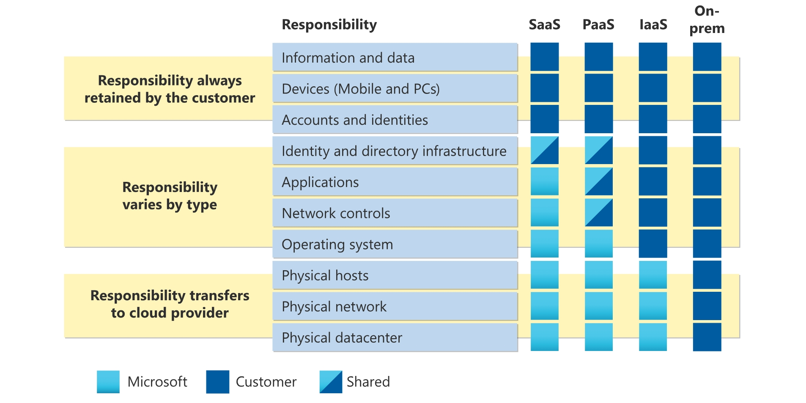
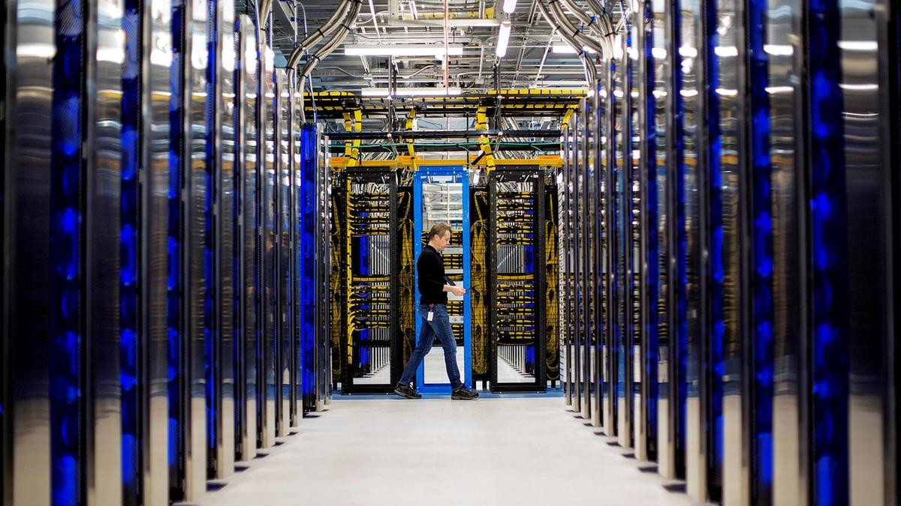
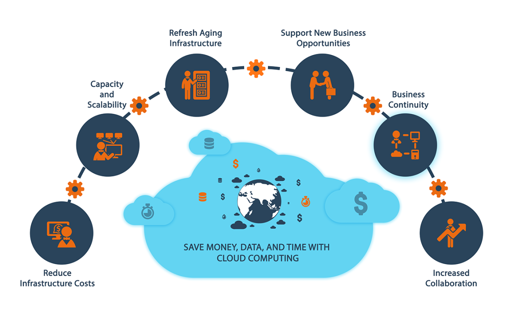
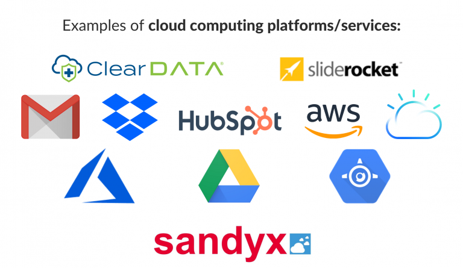

# Introduction to Cloud Computing and Azure

## What is Cloud Computing?
Cloud computing is the delivery of computing services over the internet (the cloud), allowing you to store and access data and programs without owning the physical hardware.

### Key Points:
- Internet-based computing
- On-demand access to resources
- Pay-as-you-go pricing model

<iframe width="560" height="315" src="https://www.microsoft.com/en-gb/videoplayer/embed/RE4LyBB?postJsllMsg=true&autoCaptions=en-gb" frameborder="0" allow="accelerometer; autoplay; clipboard-write; encrypted-media; gyroscope; picture-in-picture" allowfullscreen></iframe>

## Types of Cloud Services
### Infrastructure as a Service (IaaS):
- Provides virtualized computing resources over the internet.
- Examples: Virtual machines, storage, and networks.

### Platform as a Service (PaaS):
- Provides a platform allowing customers to develop, run, and manage applications.
- Examples: Web app hosting, development tools.

### Software as a Service (SaaS):
- Delivers software applications over the internet, on a subscription basis.
- Examples: Email services, office software, streaming services.

### Shared Responsibility Model:
You may have heard of the shared responsibility model, but you may not understand what it means or how it impacts cloud computing.

Start with a traditional corporate datacenter. The company is responsible for maintaining the physical space, ensuring security, and maintaining or replacing the servers if anything happens. The IT department is responsible for maintaining all the infrastructure and software needed to keep the datacenter up and running. They’re also likely to be responsible for keeping all systems patched and on the correct version.

With the shared responsibility model, these responsibilities get shared between the cloud provider and the consumer. Physical security, power, cooling, and network connectivity are the responsibility of the cloud provider. The consumer isn’t collocated with the datacenter, so it wouldn’t make sense for the consumer to have any of those responsibilities.

At the same time, the consumer is responsible for the data and information stored in the cloud. (You wouldn’t want the cloud provider to be able to read your information.) The consumer is also responsible for access security, meaning you only give access to those who need it.

Then, for some things, the responsibility depends on the situation. If you’re using a cloud SQL database, the cloud provider would be responsible for maintaining the actual database. However, you’re still responsible for the data that gets ingested into the database. If you deployed a virtual machine and installed an SQL database on it, you’d be responsible for database patches and updates, as well as maintaining the data and information stored in the database.

With an on-premises datacenter, you’re responsible for everything. With cloud computing, those responsibilities shift. The shared responsibility model is heavily tied into the cloud service types (covered later in this learning path): infrastructure as a service (IaaS), platform as a service (PaaS), and software as a service (SaaS). IaaS places the most responsibility on the consumer, with the cloud provider being responsible for the basics of physical security, power, and connectivity. On the other end of the spectrum, SaaS places most of the responsibility with the cloud provider. PaaS, being a middle ground between IaaS and SaaS, rests somewhere in the middle and evenly distributes responsibility between the cloud provider and the consumer.

The following diagram highlights how the Shared Responsibility Model informs who is responsible for what, depending on the cloud service type.

When using a cloud provider, you’ll always be responsible for:

- The information and data stored in the cloud
- Devices that are allowed to connect to your cloud (cell phones, computers, and so on)
- The accounts and identities of the people, services, and devices within your organization

The cloud provider is always responsible for:

- The physical datacenter
- The physical network
- The physical hosts

Your service model will determine responsibility for things like:

- Operating systems
- Network controls
- Applications
- Identity and infrastructure

## Overview of Microsoft Azure
Microsoft Azure is a cloud computing platform and service created by Microsoft, offering a wide range of services for building, deploying, and managing applications.

### Key Features:
- Wide range of services (compute, storage, databases, AI, IoT)
- Global data centers
- Integration with Microsoft products
- Strong security and compliance

## Why Use Azure?
### Benefits:
- **Scalability:** Easily scale resources up or down as needed.
- **Cost-Effective:** Only pay for what you use.
- **Flexibility:** Support for various programming languages, frameworks, and tools.
- **Reliability:** High availability and redundancy.

## Real-World Examples of Cloud Computing
### Examples:
- **Netflix:** Uses cloud services to stream videos to millions of users.
- **Dropbox:** Provides cloud storage services for documents, photos, and videos.
- **Online Gaming:** Games like Fortnite run on cloud infrastructure to handle massive amounts of players.

## Discussion/Q&A
### Questions:
- Can you think of any other examples of cloud services you use daily?
- Why do you think companies prefer using the cloud over traditional data centers?
- What are some potential challenges or concerns with cloud computing?

## Activity: Cloud in Daily Life
### Objective:
Relate cloud computing concepts to everyday experiences.

### Instructions:
- Share any cloud services you use at home or school (e.g., Google Drive, iCloud).
- Discuss how these services store data and provide access from any device.
