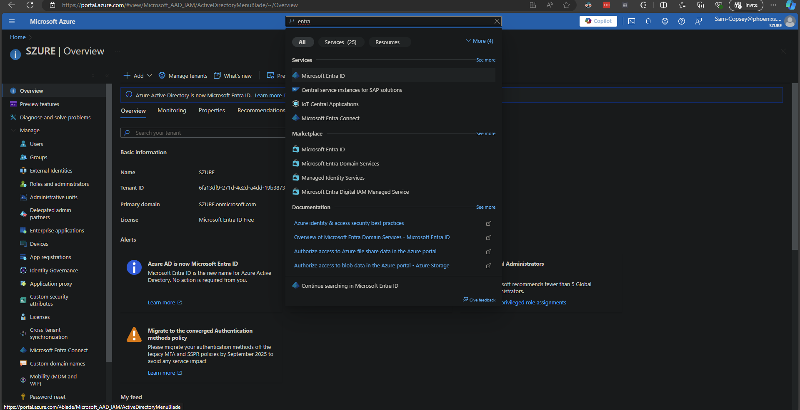
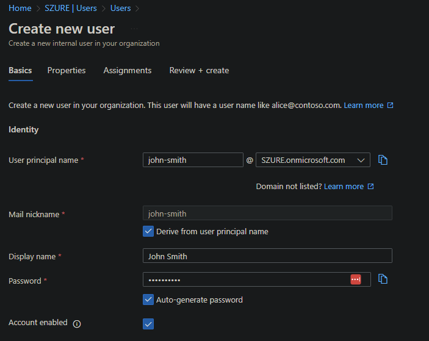

# Creating an Azure User Account

## Objective:
Get hands-on experience with Azure by setting up a user account.

## Steps:

1. **Go to the [Azure Portal](https://portal.azure.com) and sign in with your account provide by the proctor.**

2. **Use the search menu to find and go to Entra ID.**
   - From the left hand menu click Users

   

3. **Click New User and then Create new user**
    - Give your user a name and a display name 
    - Click next and fill in as many fields as you want 
    - On the assignments page leave it blank and click next 
    - At Review + create click create

    

4. **Access the Azure portal.**
   - You will be redirected to the Azure portal dashboard where you can start exploring Azure services.

## Exploration:
Take a few minutes to navigate through the Azure portal. Familiarize yourself with the dashboard, menus, and available services.

## Helpful Resources:
- [Azure Documentation](https://docs.microsoft.com/en-us/azure/)
- [Azure YouTube Channel](https://www.youtube.com/user/windowsazure)
