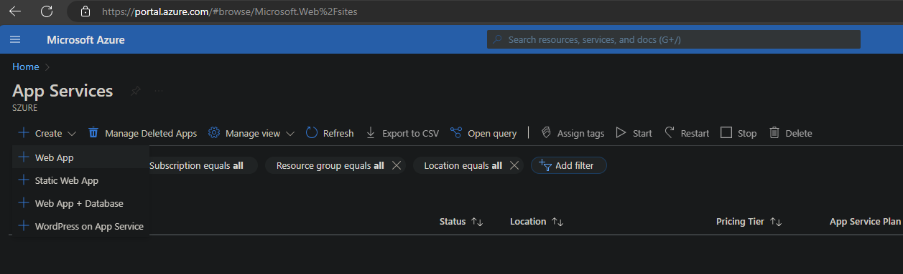
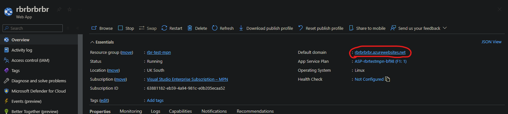

# Deploying a Web App on Azure

## Objective:
Learn how to deploy a simple web application on Azure.

## Steps:

1. **Open the Azure portal and navigate to "Resource Groups".**
   - Click on "Create a Resource Group".
   - **Name:** Use the Azure abbreviations naming convention, e.g., `rg-uk-south-yourinitials` (replace `yourinitials` with your own initials).
   - **Region:** Select "UK South".
   - Click "Review + Create" and then "Create".

2. **Navigate to "App Services".**
   - Click on "Create a Resource" and select "Web App".

   

3. **Fill in the basic details:**
   - **Subscription:** Select your subscription.
   - **Resource group:** Choose the resource group you created earlier (`rg-uk-south-yourinitials`).
   - **Name:** Choose a unique name for your app.
   - **Region:** Ensure it is set to "UK South".
   - **Runtime stack:** Select Python 3.12.
   - **Operating System:** Choose your preferred operating system.

4. **Configure the hosting plan:**
   - Choose a hosting plan (Select Free for this exercise).
   - Click "Review + Create" and then "Create".

5. **Access and test the deployed web app:**
   - Once deployment is complete, go to the URL provided by Azure to see your running web app.

## Helpful Resources:
- [Quickstart: Create a Node.js web app - Azure App Service](https://docs.microsoft.com/en-us/azure/app-service/quickstart-nodejs)
- [Azure App Service Documentation](https://docs.microsoft.com/en-us/azure/app-service/)
